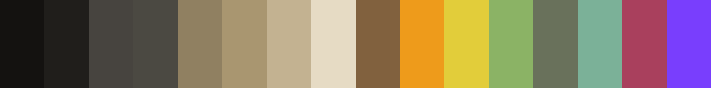
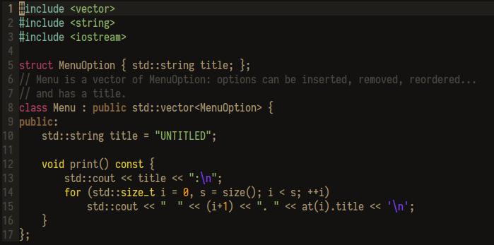

# base16-tucson-schemes

Tucson color schemes for base16 themes.

Inspired by the colors of the Sonoran desert, I designed the Tucson
theme to provide good contrast and moderately warm unsaturated colors
that are easy on the eyes and don't turn code into rainbow soup. The
base theme is optimized to get the appearance I wanted from the Vim
template.

## Colors

* base00 - base01: velvet mesquite
* base02 - base07: desert earth tones
* base08: coyote brown
* base09: desert poppy
* base0A: palo verde flowers
* base0B: saguaro
* base0C: jumping cholla
* base0D: bursage
* base0E: prickly pear fruit
* base0F: sunset sky

